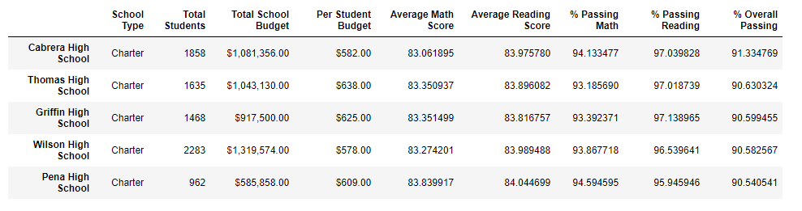

# School_District_Analysis

## Overview of Project

### Purpose
To create some insight into the performance trends and patterns by using stardardized testing data and date from a few other sources. There was a concern with some information from the ninth grade class at Thomas high school.  It was decided to remove the date for this from the orginal data to not prevent this project from being completed.

## Results

### District Wide Summary 
Analysis of the district data shows overall that the district's Reading departments are well run as 85% of students are passing reading. The math departments in the district might need some reorganization as only 74% of students are passing math.

 
Removing the tampered data reduced passing percentages across the board by 1%, it does not seem that removing the freshman grades from Thomas Highschool had much impact on the district.

With the inclusion of tampered data Thomas High School was one of the top performing schools in the district.

Without the freshman data Thomas High's performance decreases. Every performance metric drops and the overall passing percentage drops by around 25 percentage points from 90% to around 65%. 

### School Summary
#### Top 5
The removal of Thomas High freshman data had a prominent effect on the district rankings as they were knocked out of the top 5 performing schools.

Even with the removal of Thomas five from the top 5, it remains dominated by Charter Schools. Charter Schools tend to be small to medium sized making them easier to administer, it is likely this is leading their higher performance.

#### Bottom 5
The bottom 5 schools were not affected with the removal of data. The bottom 5 schools were still all medium to large sized district schools.

#### Scorces by grade

Average math scores by grade per school.

Average reading scores by grade per school.

## Summary
The tampering of Thomas High School data, while debilitating to Thomas High's metrics, overall did not have a major impact on the school district's metrics. The data overall suggests that smaller to more medium sized schools have the greatest chance to be successful. If additional resources were to be distributed within the district, I would suggest more resources be directed towards the math departments, as they were underperforming compared to the ELA departments.
